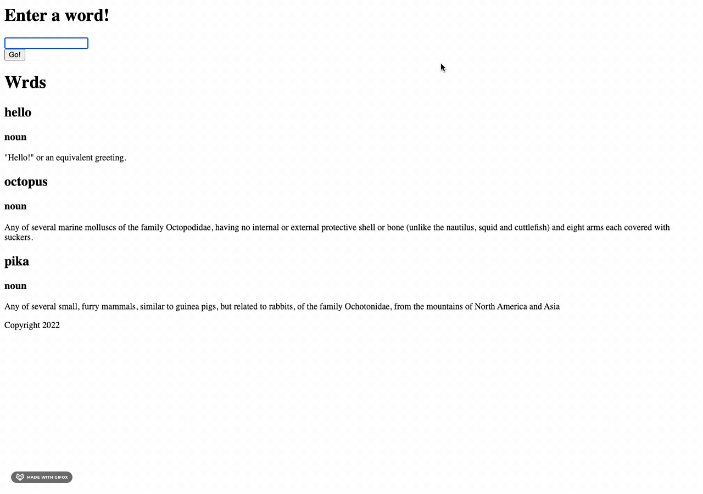

This React frontend connects to a Rails [backend](https://github.com/sararsaurus/dictionary-api) that asks a user to type in a word and returns the first definition from [Free Dictionary API](https://dictionaryapi.dev/).

